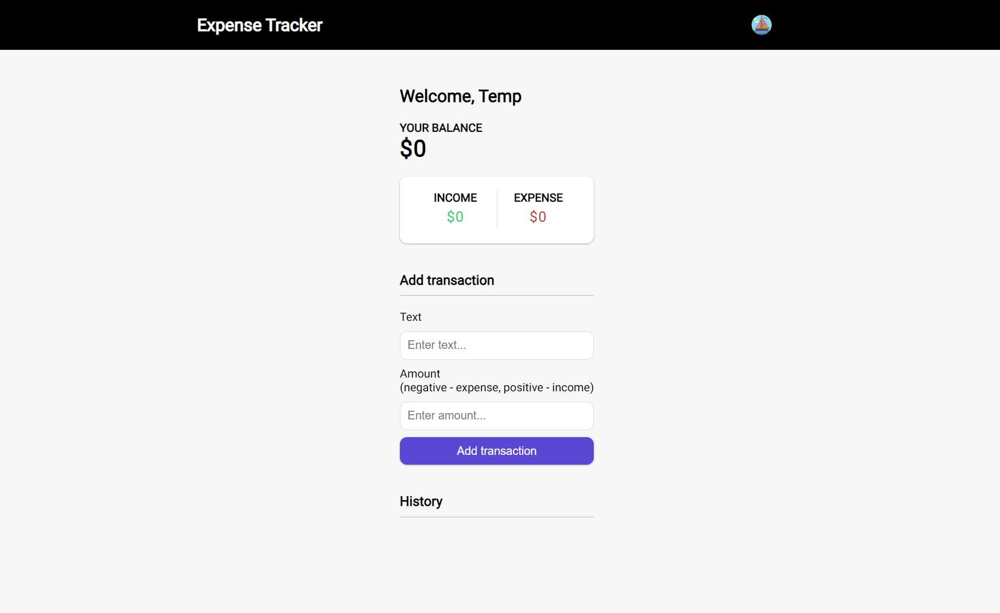
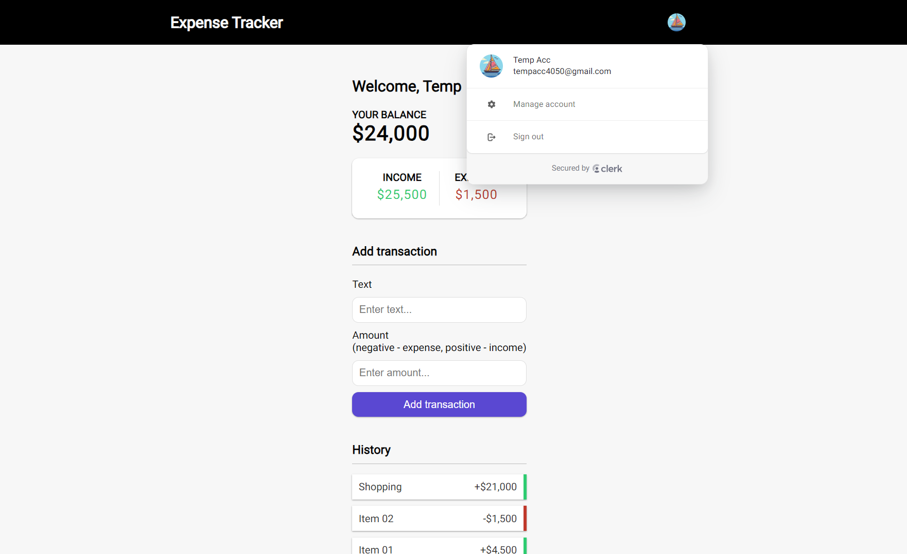

# Expense Tracker (Next.js, TypeScript, Neon & Clerk)

## Project setup and run

### Clone this github repo

```bash
git clone https://github.com/dinbandhu12/expense-tracker-nextjs.git
```

### Open in VS Code editor then

### Install dependencies:

```bash
npm install
```

### Add Environment Variables:

Rename the `.env.example` file to `.env.local` and add the following values:

Use your own neon db key and clerk keys

- `DATABASE_URL`: Your db string from https://neon.tech
- `NEXT_PUBLIC_CLERK_PUBLISHABLE_KEY`: Your Clerk public frontend API key from https://dashboard.clerk.dev/settings/api-keys
- `CLERK_SECRET_KEY`: Your Clerk secret key from https://dashboard.clerk.dev/settings/api-keys

Run the development server:

```bash
npm run dev
```

Open [http://localhost:3000](http://localhost:3000) with your browser to see the result.


## Project output

Application for tracking income and expenses. 

It uses Next.js with [Neon](https://fyi.neon.tech/traversy) for getting data and [Clerk](https://go.clerk.com/BsG2XQJ) for authentication.


Click here to try -> [Try here](https://expense-tracker-gamma-seven-39.vercel.app/)

<div style="text-align:center;margin:30px auto;">
  
  
</div>